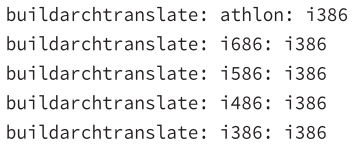

### RPM Config Files
Used if you build RPM packages and want to optimize for your CPU <br>
Main RPM config file is ```/usr/lib/rpm/rpmrc``` - you shouldn't edit this file <br>
Create and edit ```/etc/rpmrc``` <br>
<br>
Most files include ```buildarchtranslate``` lines to use one set of optimizations for a family of CPUs <br>
>Example <br>
>  <br>
> Tells RPM to translate athlon i686, i586, i486, i386 to i386 CPU codes, to use the i386 optimizations

<br>

### Yum Config Files
Configured via ```/etc/yum.conf``` <br>
Contains options, such as directory to download RPMs and where to log activities <br>
```/etc/yum.repos.d/``` holds files that describe a Yum repository - a site that holds RPMs that can be installed by YUM <br>

<br>

#### Yum Repos
**Livna** ```https://rpm.lvina.org``` multimedia tools <br>
**Red Hat** ```https://kde-redhat.sourceforge.net``` <br>
