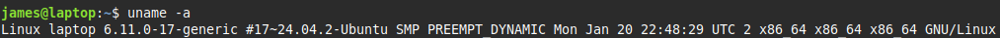

### The Kernel: the first process

You can get info about the kernel using ```uname``` command. <br>

> ```uname```
>  
> |    | option                                         |
> |----|------------------------------------------------|
> | -n | Display system node name i.e. network hostname |
> | -s | Kernel name                                    |
> | -v | Kernel version                                 |
> | -r | Kernel version number                          |
> | -m | Machine information e.g. CPU code              |
> | -p | CPU information                                |
> | -i | Hardware platform                              |
> | -a | All information                                |

 <br>
