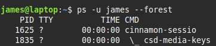

### Examining Processes

Display process status <br>
> ```ps``` <br>
> <br>
> **Option Types** <br>
> ps supports three different types of options: <br>
>
> |                 |                    |                                                                                 |
> |-----------------|--------------------|---------------------------------------------------------------------------------|
> | single dash (-) | *Unix98 options*   | single-character options may be grouped together and preceded with a single dash |
> | no dash ()      | *BSD options*      | single-character options may be grouped together with no initial dash           |
> | two dashes (--) | *GNU Long Options* | multi-character operations never group together                                 |

> **Options**
>
> |                                           |                                            |  
> |-------------------------------------------|--------------------------------------------|
> | ```--h```                                 | display help                               | 
> | ```-A```                                  | display all processes on the system        | 
> | ```-x```                                  | display all processes owned by the user    | 
> | ```-u user```                             | display processes owned by user or user ID | 
> | ```-f``` ```-l``` ```j``` ```l``` ```u``` | display extra information                  | 
> | ```-H``` ```-f``` ```--forest```          | group processes and use indentation        |

 <br>

> **Output Column Names** <br>
> * **PID** Process ID <br>
> * **PPID** Parent Process ID <br>
> * **TTY** The teletype is a code used to identify a terminal <br>
> * **TIME** **%CPU** measure CPU time consumed and percentage when it executed <br>
> * **CPU Priority** Default value 0. Positive values reduce priority, negative increase <br>
> * **Command** Launch process
