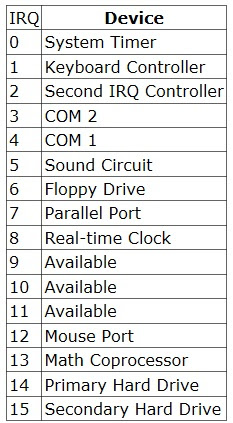
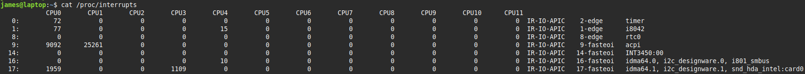

### IRQ
* **Interrupt Request** rr **interrupt** 
* is a signal sent to the CPU to suspend its current activity and handle an external event  
* e.g. keyboard input  
* IRQs are numbered 0 - 15
 

Common IRQs  
  

Modern computers often use a higher IRQ for sound cards  
You can see what IRQs are being used by examining `/proc/interrupts`  
  

#### proc
* The `/proc` filesystem is a virtual  filesystem  
* It doesn't refer to files on a hard disk, but to kernel data  
* The files in /prof contain info about hardware, running processes etc

