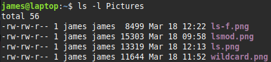
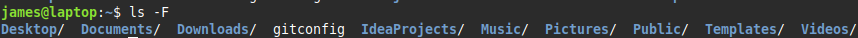

### ls

> `ls [options] [files]` &nbsp;&nbsp;&nbsp;&nbsp; *options/files are optional*  
> list files in directory
> ![](../../Image/ls.png

> `ls -l`  
> long listing  
> show permissions, ownership, file size, creation date, file name  
> 

> `ls -a`  
> show hidden  

> `ls -F`  
> show file type  
> `/` &nbsp;&nbsp; directory  
> `.` &nbsp;&nbsp; executable  
> `|` &nbsp;&nbsp; named pipe  
> `=` &nbsp;&nbsp; socket  
> `@` &nbsp;&nbsp; symbolic link  
> 

> `ls -R`  
> recursive  
> display current directory and all of its subdirectories  

