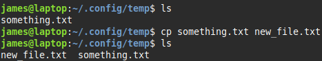
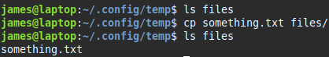

### cp

> `cp [options] source [destination]` &nbsp;&nbsp;&nbsp;&nbsp; *source can be multiple files*  
> `cp old-file new-file`  
> copies a file

The destination may be a directory  
  

| option |                                                                                                              |
|--------|--------------------------------------------------------------------------------------------------------------|
| -f     | force   overwrite files without prompting                                                                 |
| -i     | interactive   ask before overwriting files                                                                |
| -R     | recursive   if you specify the source as a directory, the directory and all its subdirectories are copied |
| -u     | update only if source is newer than target or target doesn't exist                                           |
                                                                                                          |

