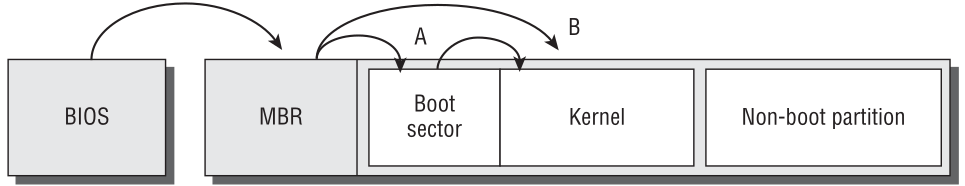
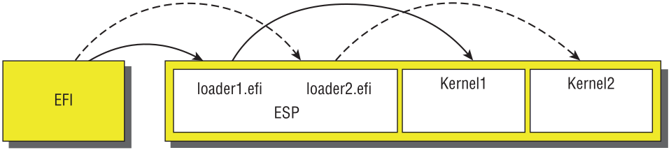

# Boot Loader Principles

### BIOS Booting

1. **Firmware** loads **BIOS**
2. in BIOS configure boot order for bootable devices (e.g. hard drive, then USB)
3. from bootable device BIOS loads **Master Boot Record (MBR)**
MBR contains the **Primary Boot Loader** 
&nbsp;

**Primary Boot Loader:**
1. loads **Boot Sector** from device
2. the Boot Sector contains a secondary boot loader which when executed loads the OS kernel
&nbsp;

* Windows uses (path A) - boot sector loads Windows Boot Manager
* Linux uses either (path A) or (path B)
&nbsp;

### EFI Booting
**EFI System Partition (ESP)**
Boot Loaders are stored as files in a disk partition known as the EFI System Partition (ESP)
ESP is mounted at `/boot/efi`
&nbsp;

**Boot Loaders**
stored in .efi files
e.g. `/boot/efi/EFI/ubuntu/grub.efi`
lets you store a separate boot loader for each 0S installed on the computer
&nbsp;

**Boot Manager**
the EFI firmware includes a Boot Manager program
it lets you select which boot loader to launch
&nbsp;

