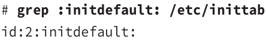
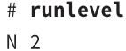

# Checking Runlevel

#### Checking Default Runlevel
Check the `/etc/inittab` file
example

the default runlevel has id:2
&nbsp;
&nbsp;

#### Changing Default Runlevel
Edit the **initdefault** line in `/etc/inittab`
if the system doesn't have that file, create one with only an **initdefault** line
&nbsp;

> #### Checking Current Runlevel
> `runlevel`
> example
> 
> **N** → THE system hasn't switched runlevels since booting
>
&nbsp;

#### Chaning Runlevels on a Running System
e.g. chaning from GUI → CLI
you can use:
1. `init`
2. `shutdown`
3. `halt`
4. `reboot`
5. `poweroff`

> #### init
> `init runlevel`
> example
> *init 1* → change the runlevel to 1

> #### telinit
> **available in SysV, Upstart, systemd**
> `telinit runlevel [options]`
> same as **init** but has an option to reload */etc/inittab*
> |||
> |-|-|
> | `q` | reload */etc/inittab* and any changes |
>
> example
> `telinit q`

> #### shutdown
> `shutdown [options] [time] [message]`
> sends a  message to all users who are logged in 
> lets you specify when to change change runlevel, so users have to to save and exit
> ||||
> |-|-|-|
> | option | `now` | shutdown now |
> | option | `-r` | reboot |
> | option | `-P` | powers off |
> | option | `-h` | halt, shutdown without powering off off|
> | option | `-c` | cancel a pending shutdown |
> | time | `hh:mm` | 24 hour clock format|
>
> example
> `shutdown -h +15 "system going down for maintenance"`

> #### halt, reboot, poweroff
> **available in SysV, Upstart, systemd**
> `halt` shutdown without powering off
> `reboot`
> `shutdown`