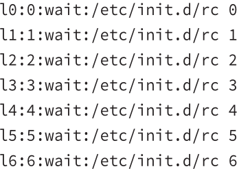

# Runlevel Functions

Numbered 0 to 6
|runlevel||
|-|-|
| 0 | transitional level  used to shut down system |
| 1, s, S | single user mode  like safe mode in windows |
| 2 | Debian distros → multi-user mode with GUI |
| 3 | Redhat → multi-user mode with CLI |
| 4 | undefined |
| 5 | Redhat → multi-user with GUI |
| 6 | reboot system |

### Runlevel Services
Found in `/etc/inittab`
syntax: `id:runlevels:action:process`
|||
|-|-|
| id | **identification code** |
| runlevel | **application runlevels** for this entry  e.g. 345 means runlevels 3,4,5 |
action | **action to be taken**  how to treat the process  *wait* means start the process and wait for it to terminate |
| process | **process to run** |

example

&nbsp;

### Startup Scripts
1. the **rc** script runs scripts for each runlevel
2. symbolic links to scripts are place in runlevel-specific directories
3. **rc** passes a **start** parameter to all the scrips with names that being with **S**, and a stop parameter to all the scripts with names that begin with **K**

