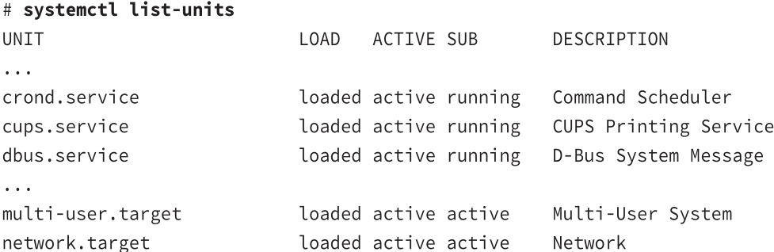
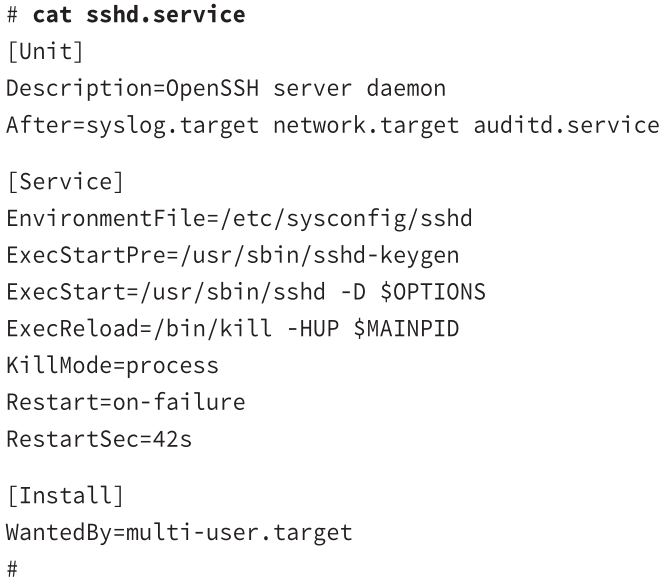
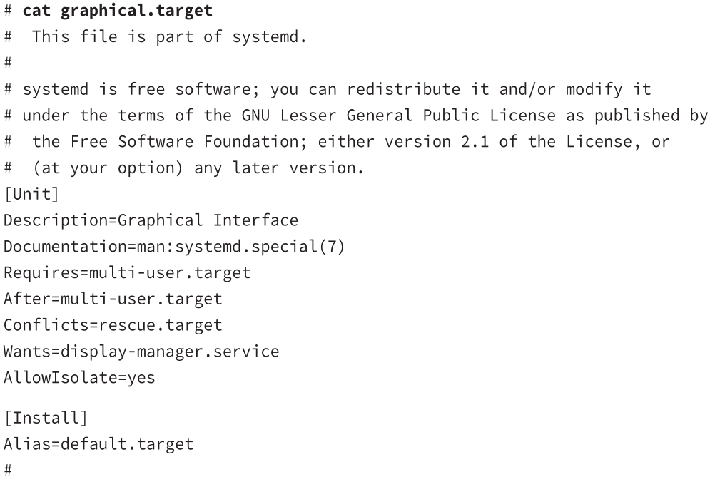
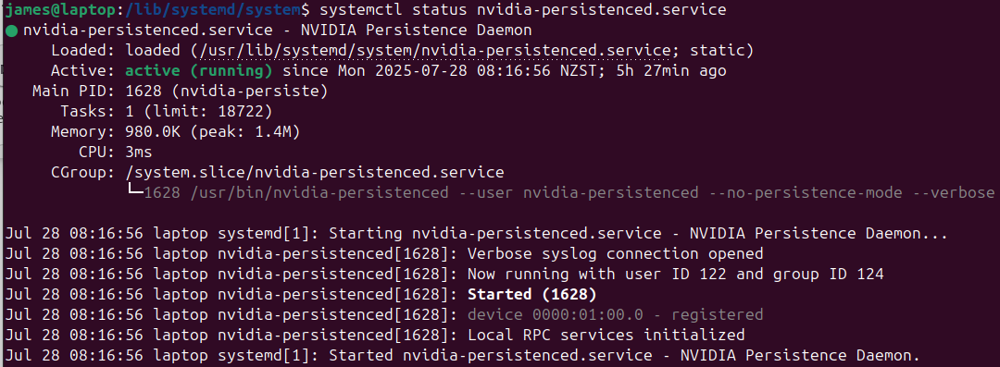

# systemd

system initialization process
* the default for Red Hat and Debian distros
* instead of lots of small initialization scrips, is uses one program that uses configuration files for each service

# Units and Targets
### unit and targets
**units**
* what you operate on and manage
  * defines a service
  * consists of name, type, configuration file
    *e.g.*
    * automount
    * device
    * mount
    * path
    * service
    * snapshot
    * socket
    * target
&nbsp;

**targets**
group units together

> #### systemctl
> system control
> `systemctl [options] command [unit]`
> example
> 
> e.g. network.target groups all the units needed to start the network interfaces for the system
> &nbsp;
> * instead of changing runlevels to alter what's running, you change **targets**
> * called **runlevel0.target** - **runlevel6.target**

# Configuring units
### Configuration file
each unit requires a configuration file
defines what program it starts
how it should be started
files are stored in `/lib/systemd/system`
&nbsp;

#### Service

**/usr/sbin/sshd** program to run
**After=...** services to run after
**WantedBy=...** target level the system should be in
**Restart=...** how to reload the program
&nbsp;

#### Target
define which service units to start

**Requires, After, Conflicts**

# Setting Default Target
The default target when Linux boots is `/etc/systemd/system/default.target`
it's normally a link to a file in */lib/systemd/system*

> #### systemctl
> system control
> control services and targets
> `systemctl [options] command [unit]`
> |commands||
> |-|-|
> | `list-units` ||
> | `start name`||
> | `stop name` ||
> | `reload name` | reload unit configuration file |
> | `restart name` | shut down and restart |
> | `status name` ||
> | `enable name` ||
> | `disable name`||
>
> example
> 
