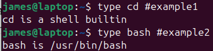
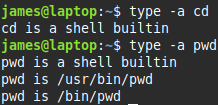

# Internal Commands

Built-in commands
&nbsp;
> ### cd
> change directory
> `cd /home/james`
> <mark>~</mark> stands for the users home directory

> ### pwd
> print working directory

> ### echo
> prints the text you enter
> good way to see contents of variables
> `echo $PATH`

> ### time
> how long command takes to execute
> `time pwd` tells you how long it too to execute the pwd command
> three times are displayed:
> 1. total execute time
> 2. user CPU time
> 3. system CPU time

> ### set
> displays all shell variables/functions
> including environment variables and shell internal variables
> you can enable/disable options:
> &nbsp;&nbsp;`set -x` turns on debugging
> &nbsp;&nbsp;`set -- arg1 arg2` sets positional parameters $1, $2 to arg1 and arg2

> ### exit
> terminates the shell
>
> ### logout
> terminates only *login shells*
> *login shells* automatically launch when you log in
> a terminal on a GUI is not a login shell ✗
> SSH into remote server ✓

> ### type
> checks if a command is a built-in 
> 
> *example1* `cd` is in-built command
> *example2* `usr/bin/bash` is the path to the executable file - it's a standalone program
> <span/>
> Some commands are <mark>duplicated</mark> - has an internal and external executable/s
> internal commands take precedence
> to check use ```–a```
>  <br>
