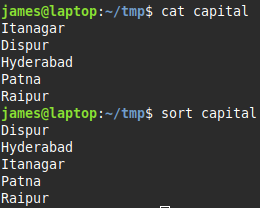
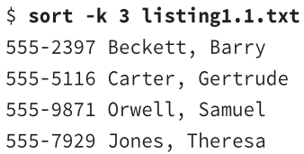
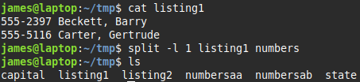
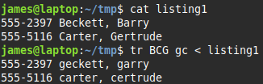
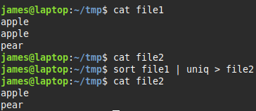
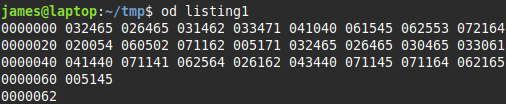
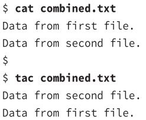
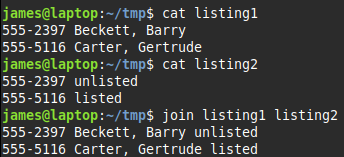
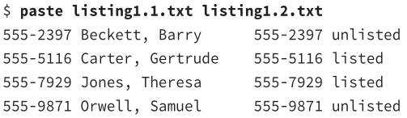
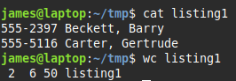

# Viewing files

> ### head
> <li>view the start of a file</li>
> <li>first 10 lines by default</li>
> 
> options:
> |                             | |
> |-----------------------------|-|
> | `-c num` <br> `--bytes=num` | view first **num** bytes |
> | `-n num` <br> `--lines=num` | view first **num** lines |

> ### tail
> <li>view the end of a file</li>
> <li>has options same as head and some extra ones:</li>
> 
> |                             | |
> |-----------------------------|-|
> | `-f` <br> `--follow` | keep the file open and display new lines as they're added <br> good for tracking log files |
>
> example
> combining head with tail  
> extract the first 15 lines, then display its last 5 lines
> `head --n 15 sample.txt | tail --n 5`
<hr/>

# Transforming files
These commands don't change files contents, but instead send the changed file contents to STDOUT

> ### expand
> converting tabs to spaces

> ### unexpand
> convert spaces to tabs
   

> ### sort
> sort a file
> 
>
> options
> |               | |
> |---------------|-| 
> | Ignore case   | `-f` `--ignore-case` don't differentiate uppercase/lowercase |
> | Month         | `-M` `--month-sort` sort by three letter month abbreviation e.g. JAN |
> | Numeric       | `-n` `--numeric-sort` sort by number |
> | Reverse       | `-r` `--reverse-order` sorts in reverse order |
> | Field         | `-k` `--k=field` by default uses the first field as its sort field, you can specify another field/s |
> 
> 


> ### split
> split a file into multiple files
> options
> |         |                                    |
> |---------|------------------------------------|
> | Split by bytes | `-b size` `--bytes=size` breaks input file into pieces by maximum *size* bytes |
> | by bytes in line-size chunks | `-C=size` `--line-bytes=size` same as split by bytes, but without breaking lines  |
> | by number of lines | `-l lines` `--lines=lines` |
> 
> example - split listing1 into two files – *numbersaa* and *numbersab*
> 
   
> ### tr
> translate (replace)
> <li>replace characters in a SET1 with characters in SET2</li>
> <li>each character in SET1 is replaced by the one at the equivalent position in SET2</li>
> <br>
> 
> `tr [options] set1 [set2]` translate characters from SET1 to SET2 
> <br>
>
> options
> |                        | |
> |------------------------|-|
> | `-t` `--truncate-set1` | truncate SET1 to size of SET2 |
> | `-d`                   | delete characters from SET1, no need for a SET2  |
> 
> example: B→b, C→c, G→c
> *note that set2 was smaller than set 1, it substitutes the last letter from set2 for the missing letter*
> 
> <br>
> 
> **shortcuts**
> |                   | |
> |-------------------|-|
> | `:alnum`          | truncate SET1 to size of SET2 |
> | `:upper` `:lower` | delete characters from SET1, no need for a SET2 |
> | `:digits`         | delete characters from SET1, no need for a SET2 |
>
> examples
> `echo "hello world 123" | tr '[:lower:]' '[:upper:]'` converts all lowercase to upper
> `echo "password" | tr '[:alnum:]' '*'` replace all characters with *
> `echo "hello, world! 123" | tr -d [:punc:][:space:]` delete punctuation and whitespace

> ### uniq
> delete duplicate lines 
> e.g. if you've sorted a file and don't want duplicates e.g. Shakespeares vocabularly
> 
    
> ### od
> octal dump
> <li>For displaying files that are not easily displaYed in ASCII</li>
> <li>e.g. audio files etc will look like gibberish</li>
> <li>displays a file in octal (base 8) numbers by default</li>
> 
>
<hr/>

# Combining Files
> ### cat
> concatenate
> **display:**
> `
> cat first.txt
> Data from first file
> `
> **to file:**
> `cat first.txt second.txt > combined.txt`
> <br>
> 
> options
>
> |                            | |
> |----------------------------|------------------------------------------------------------|
> | Display line ends          | `-E` `--show-ends` <br>add **$** (dollar sign) at the end of each line |
> | Number lines               | `-n` `–number` <br>add line number to start each line |
> | Minimize blank lines       | `-s` `--squeeze-blank` <br>Compresses groups of blank lines to a single line |


> ### tac
> Same as cat but it reverses the order of lines in the output
> 


> ### join
> Like a <mark>database join</mark>
> By default, uses the first field as they key to match across files
> 
> Can use another field as the key 
> ```join –1 3 –2 2 cameras.txt lenses.txt```
> join using **3rd** field in cameras and **2nd** field in lenses

> ### paste
> Merge files line by line, separating each line with a tab
>  
<hr/>

# Formatting files
Commands that reformat the text in a file

> ### fmt
> 
> <li>limit text files width</li>
> <li>75 characters by default</li>
> 
> 
> options:
> |                            |                                     |
> |----------------------------|-------------------------------------|
> | `-w width` `--width=width` | set line length to width characters |

> ### nl
> numbers non-blank lines of a file
> options:
> |       | |
> |-------|-|
> | numbering style <br> `-b style-option` <br> `--body-number=style-option` | **style-option** <br> t - default, numbers lines except empty <br> a - number all lines including empty one  |
> | new page <br> `-p` `--no-renumber` | default is to number each new page starting with 1, the options don't reset the line number with a new page |
> | page separator <br> `-d=code` `--section-delimiter-code` | **code** is the delimeter that defines a new page |
>
> example
> you get error messages that refer to a script line
> to add line numbers to the script
> `nl –b a somescript > numberedscript.txt`

> ### pr
> prepare a file for printing
> by default creates a header which includes: <li>current date/time</li> <li>filename</li> <li>page number</li>
>
> options:
> |                   | |
> |-------------------|-|
> | multi-column output <br> `-numcols` <br> `--columns=numcols` | creates output with **numcols** columns          |
> | double spacing <br> `-d` <br> `--double-spaced` | double spaced output |
> | page length <br> `-l lines` <br> `--length-lines` | page length in **lines**            |
> | header text <br> `-h text` <br> `--header=text` | set text to be displayed in header, replacing the filename |
> | omit header <br> `-t`  `--omit-header` | |
> | left margin <br> `-o chars` <br> `--indent=chars` | sets left margin to **chars** characters      |
> | page width <br> `-w chars` <br> `--width cars` | |
>
> example
> `cat –n /etc/profile | pr –d | lpr`
> **cat –n** &nbsp; output with line numbers
> **pr –d** &nbsp; double space
> **lpr** &nbsp; print the file
<hr/>

# Summarizing files

> ### cut
> cut/extract certain parts of each line and display them
> options:
> |                                     | |
> |-------------------------------------|-|
> | `-b list` <br> `--bytes=list`       | cut first **list** bytes  |
> | `-c list` <br> `--characters=list`  | cut first **list** characters |
> | `-f list` <br> `--fields=list`      | cut the specified list of fields |
>
> **list option**
> <li>a number e.g. 4</li>
> <li>a range of numbers e.g. 2-4</li>

> ### wc
> word count
> counts words, lines and bytes for a file
> 
