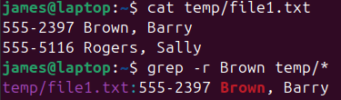

# Regex rules

Match patterns in text

|                           |         |  |
| ------------------------- | -------------- | ------- |
|                           | **example**        | **matches** |
| string                    | *hello*        | hello   |
| `\|` multiple string      | *hello\|hi*    | hello hi |
| `[]`                      | *b[aeiou]g*    | big     |
| `[-]` range               | *a(2-4)z*      | a2z     |
| `.` any character         | *a.z*          | aQz     |
| `^` start of line         |                |         |
| `$` end of line           |                |         |
| **repetition**            |                |         |
| `*` 0+                    |                |         |
| `+` 1+                    |                |         |
| `+?` 0 or 1               |                |         |
| `()` groups part of regex |                |         |
| `\` escape                | *example\.com* | example.com |

# Commands
> ### grep
> <li>global regular expression print</li>
> <li>reads input line by line, if there's a match the entire line is printed with the match highlighted</li>
> 
> `grep [options] regex [files]`
> 
> options: 
> |                      |                                                       |
> | -------------------- | ----------------------------------------------------- |
> | `-r` `--recursive`   | search in a directory and subdirectories              |
> | `-i` `--ignore-case` | non case sensitive                                    |

> 
> examples
> `ps -e | grep chrome`
> <li>see process number for processes called chrome</li>
> <li>-e shows all processes</li>
>  
>
> <li>finds all files that contain string Brown</li>
> <li>searches recursively</li>
> 
> 
>  
> 
>  `grep -e "(something\.example\.com).*200" /etc/*`
>  <li>-e extended regular expression rules, rather than just basic</li>
>  <li>for some regex you need to use quotes, otherwise the shell can interpret it incorrectly</li>
>  <li>Match the URL, then any number of characters before 200</li>

> ### sed
> modifies a files contents
> modifications are temporary unless you save them
> `sed [options] -f script-file [input-file]`
> `sed [options] 'script-text' [input-file]`
>  
> 
> **address**
> sed command operates on addresses, which are line numbers
> <li>no address - operates on all lines</li>
> <li>one address</li>
> <li>range of addresses</li>
>  
> 
> options:
> |                       |  |                                           |
> | ----------------------|---------|-------------------------------------------|
> |                       | **address** |                                           |
> | `a\text`              | 0 or 1  | append text to file                       |
> | `i\text`              | 0 or 1  | text into file                            |
> | `c\text`              | range   | replace selected lines with provided text |
> | `s/regex/replacement` | range   | replace the text that matches             |
> 
> example
> `sed 's/2012/2013/' calender1.txt  calendar2.txt`
> <li>replace the first occurrence of 2012 on each line with 2013</li>
> <li>send the output in calendar2.txt</li>
