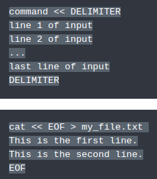
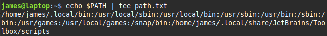
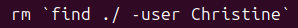
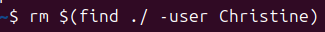

# Intro
- Linux treats the input and output from programs as a stream
- You can redirect streams to come/go to other sources e.g. files
- you can pipe a programs output stream to anothers input

# Stream
Linux handles all objects as files
this includes a programs input/output stream
to identify a file, linux uses <mark>file descriptors:</mark>
 
> ### Standard Input
> Programs accept keyboard input via *standard input*  
> in most cases, this data comes from the keyboard
> **abbreviation:** STDIN  
> **file descriptor:** 0
 
> ### Standard Output
> Data sent to users via *standard output*
> usually displayed on a screen
> **abbreviation:** STDOUT  
> **file descriptor:** 1
 
> ### Standard Error
> An output stream
> carries error messages
> **abbreviation:** STDERR  
> **file descriptor:** 2
 
**programs treat STDIN, STDOUT and STDERR like files  
They open/read/write/close them when**

# Redirect
To redirect to input or output, you use operators
e.g. `echo $PATH1 > path.txt` sends $PATH to path.txt
 

### Redirect Operators
<mark>The arrow points to the target</mark>
|       |                                                                                    |
| ----- | ---------------------------------------------------------------------------------- |
| `>`   | **creates a new file containing output**    **if file exists, it's overwritten** |
| `>>`  | **appends output to existing file**    **if file doesn't exist, it's created**   |
| `<`   | **sends contents as input**                                                        |
| `2>`  | new file containing STDERR                                                         |
| `2>>` | appends STDERR                                                                     |
| `&>`  | new file with both STDOUT and STDERR                                               |
| `<<`  | accepts text on lines below it as STDIN (see example)                                           |
| `<>`  | the specified file to be used for both STDIN and STDOUT                            |

> ### Redirecting to null
> redirect to `/dev/null`
> used when you want to get rid of data

> ### <<
> <mark>not used much</mark>
> used to create a "here document" (often called "heredoc")
> it provides multiple 
>  
> 
> syntax
> any string can be used as delimeter, but common ones are EOF (end of > file), END
> 
> 

 # Pipe
can be used to chain commands
<mark>**command-output | command-input**</mark>
 
> ### tee
> displays output and iN as many files as you specify
> 
> goes to STDOUT and also saved in path.txt

# xargs
> ### xargs
> Builds a command from standard input
> `xargs [options] [command] [initial-arguments]`
> **command:** the command you want to execute
> **initial-arguments:** command arguments
> **options:** xargs options, not passed to command

- The command is run for every word passed to it from input
- Uses spaces and newlines as delimiters by default, which can cause issues

> *Example*
> delete files that belong to a user  
> `find / -user Christine | xargs –d "\n" rm`
> 
> <li> <mark>find / -user Christine</mark> finds all files in directory tree (/) and subdirectories belonging to Christine</li>
> <li> <mark>-d "\n"</mark> use newlines as delimeters</li>
> &nbsp;&nbsp;&nbsp;&nbsp;&nbsp;&nbsp;-d is delimeter option
   
> ### backtick \`
>  <li>Text with backticks are treated as a separate command</li>
>  <li>The output of the backtick command is passed to the command that before it</li>
> <li>All the output is passed at once, not word at a time like <mark>xargs</mark></li>

You can replace backticks with $() - so you don't confuse single quotes and backticks

