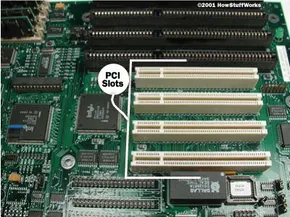
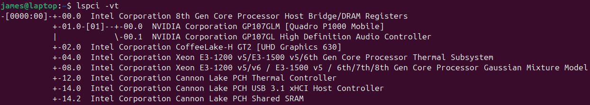
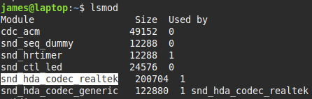

### Configuring PCI Cards
Peripheral Component Interconnect
used for connecting internal components

* the PCI bus is the standard expansion bus for internal devices 
* plug-and-Play style configuration. 
 

#### Configuration
most PCI devices configure themselves automatically. 
however you can tweak how PCI devices are detected:  
* The kernel has options that affect how it detects PCI devices. These are in the kernel config screens under Bus Options.
* Most firmware has PCI options that change the way PCI resources are allocated.

> #### setpci
>  query and adjust PCI devices configurations

> #### lspci
> * info about the PCI busses on your system
> * items connected to those busses
>  
> | options       |       |
> |---------------|-------|
> | -v, -vv, -vvv | verbose, (-vv and -vvv increase verbosity) |
> 
> 

# Kernel Modules
<li><mark>provide access to hardware</mark></li>
<li><b>a driver is a type of module but not all modules are drivers</b></li>
<li>the stand-alone files are stored in <i>lib/modules</i></li>
 
Linux loads the modules when it boots, but you can load additional modules.

> #### lsmod
> shows all the modules that are loaded
> 
> **Used by** - number of dependencies (other modules) 
> if it's being used by another module, the module name is shown next to the number 
### Loading Kernel Modules

two programs to load them: `insmod` `modprobe`
Linux loads modules automatically

> #### insmod [path]
> **must <mark>manually</mark> load module dependencies**
> you can pass in module options, that are specified in a module
> example

> #### modprobe [name]
> **<mark>automatically</mark> loads dependencies**

>
> |          |                                                |
> |-----------------|----------------------------------------------- |
> | **options**         |                                                |
> | `-C filepath`   | modproble configuration file is /etc/modprobe.conf or in /etc/modprobe.d/  you can change it by passing in  your own filepath and file |
> | `-r` `--remove` | remove module and any on which it depends that are not used elsewhere |
> | `--show-depends`| show modules that the specified module depends on |

# Removing Kernel Modules
Modules consume a small amount of memory

> #### rmmod
> `rmmod modulename`
> |          |                                                |
> |-----------------|----------------------------------------------- |
> | **options**         |                                                |
> | `-f` `--force`  | force |
> | `w` `--wait `   | wait for module to become unused then unload it |