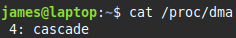

# DMA
**Direct Memory Address**
alternative to I/O ports
 

### Bypass CPU
* instead of having CPU transfer data between memory and a device
* *allows transfer directly between memory and device*

 

### Channels
Pathway to allow transfer between memory and device
 

DMA channels in use:

channel 4 is being used

