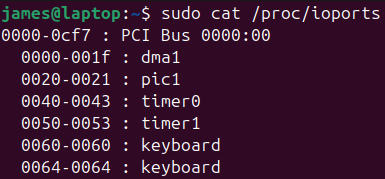

# Firmware
* Lowest level of software that runs on a computer
* Begins the boot process and configures hardware devices
* Lets you enable/disable hardware
* Once Linux boots, it uses its own drivers to access hardware
   

#### BIOS/EFI/UEFI
* The most important firmware is installed on the computers **motherboard** 
* In the past most computers used firmware called *Basic Input/Output System (<mark>BIOS</mark>)*
Since 2011, a new type of firmware known as *Extensible Firmware Interface (<mark>EFI</mark>)* or *Unified EFI (<mark>UEFI</mark>)* has become standard
* <mark>Most manufacturers refer to EFI as BIOS</mark>
 

#### Flash Memory
Firmware is stored in electronically erasable programmable read-only memory (**EEPROM**) - <mark>flash memory</mark>

# IRQ
* **I**nterrupt **R**e**Q**uest
* <mark>signal sent to the CPU to handle an event</mark>
e.g. keyboard input
 

IRQs are numbered 0 to 15, some modern computers have more
<ul>
<li>some are reserved for specific purposes e.g. keyboard</li>
<li>some are shared with common uses</li>
<li>some are left for extra devices that may be added to the system</li>
</ul>
 

#### Common IRQ
|    |          |
| -- | -------- |
| **1**  | Keyboard |
| **12** | Mouse    |

#### Examining IRQ
 `cat /proc/interrupts`

shows: 
<ol>
<li>IRQ</li>
<li>number IRQs for a CPU</li>
<li>driver name</li>
</ol>

# I/O Addresses
*also called I/O ports*
<mark>for **CPU communication** - maps l**ocation memory : hardware**</mark>
usually mapped to a specific device
 

to view:

# DMA
**Direct Memory Address**
alternative to I/O ports
 

### Bypass CPU
* instead of having CPU transfer data between memory and a device
* *allows transfer directly between memory and device*
 

### Channels
Pathway to allow transfer between memory and device
 

DMA channels in use:

channel 4 is being used

# Hotplug and Coldplug Devices

_Hotplug_: can be attached/detached when **computer on** (hot)
_Coldplug_: only attached/detached when **computer off** (cold)
 

### Coldplug
CPU, memory, PCI cards, SSDs
 

### Hotplug
Rely on software to detect changes to the system as they're attached/detached
 

#### Hotplug utilities
utilities to manage hotplug devices
enable programs to learn about hardware
receive notifications when hardware configuration changes
 

<ol>
<li><b>sysfs</b></li>
<ul>
<li>a virtual filesystem</li>
<li>mounted at <i>/sys</i></li>
<li>exports info about devices so user-space utilities can access the information</li>
</ul>

|                      |                                                       |
| -------------------- | ----------------------------------------------------- |
| **user space program** | runs as an ordinary program run by user or as root |
| **kernel space code**  | runs as part of the kernel can communicate with hardware  helps hotplug devices access hardware |

<li><b>HAL Daemon</b></li>

**H**ardware **A**bstraction **L**ayer **D**aemon
<ul>
<li>a user-space program that runs all the time</li>
<li>provides other user-space programs with hardware info</li>
</ul>
 

<li><b>D-Bus</b></li>

**D**esktop **Bus** daemon (always running in the background)
<ul>
<li>lets process communicate</li>
<li>lets process register to be notified of events by other processes or hardware</li>
e.g. new USB device plugged in
</ul>
 

<li><b>udev</b></li>
<ul>
<li>virtual filesystem mounted at `/dev`</li>
<li>creates device files as drivers are loaded/unloaded</li>
</ul>
</ol>

