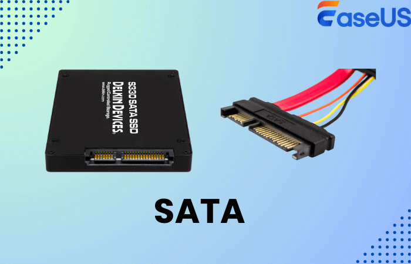
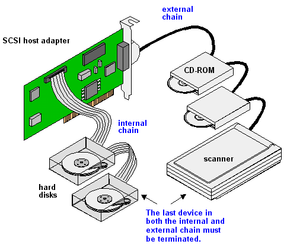
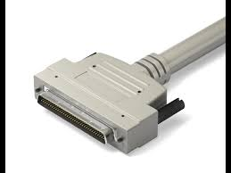

# Sata Disks
**S**erial **A**dvanced **T**echnology **A**ttachment

Most Linux SATA drivers treate SATA disks are if they were SCI disks.

# SCSI disks
**S**mall **C**omputer **S**ystem **I**nterface

 
