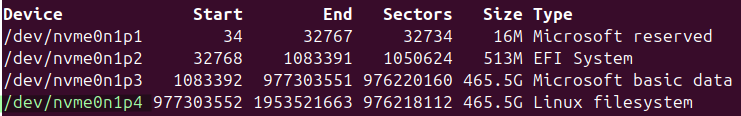
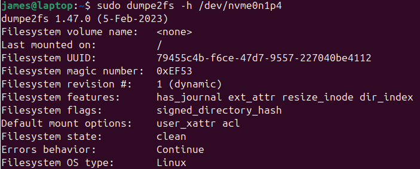

# Tuning filesystem

#### Filesystem info
> `dumpe2fs [options] device`
> info on ext2, ext3, filesystems
> **device** is the filesystem device file
>  
> example
> `sudo fdisk -l`
> 
> device file: /dev/nvme0n1p4
> 

#### Tuning filesystem parameters
> `tune2fs [options] device`
> options
> | | |
> |-|-|
> | `-c mounts` | adjust the maximum mount count  a disk can be mounted up to the maximum mount count without being checked with `fsck` |
> | `-i interval` | adjust the time between disk checks |
> | `-j` | add a journal to a filesystem  converts a ext2 into an ext3 filesystem |
> | `-m percent` | set reserved blocks  a  percentage of disk space reserved for use by *root* |

#### Mount Point
<li>A directory in the filesystem where you attach or disconnect another filesystem</li>
<li>When the fielsystem is mounted, it's contents become available</li>
<li>e.g. plugging in a USB drive will create a directory `/mnt/usb_photos` which is your mount point</li>