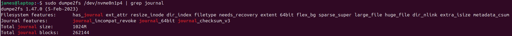
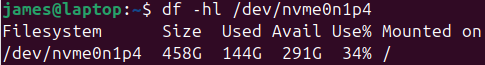
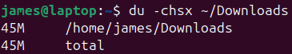

# Tuning filesystem

#### Filesystem info
> `dumpe2fs [options] device`
> info on ext2, ext3, filesystems
> **device** is the filesystem device file
> 
> example
> `sudo fdisk -l`
> 
> device file: /dev/nvme0n1p4
> 

#### Tuning filesystem parameters
> `tune2fs [options] device`
> options
> | | |
> |-|-|
> | `-c mounts` | adjust the maximum mount count  a disk can be mounted up to the maximum mount count without being checked with `fsck` |
> | `-i interval` | adjust the time between disk checks |
> | `-j` | add a journal to a filesystem  converts a ext2 into an ext3 filesystem |
> | `-m percent` | set reserved blocks  a  percentage of disk space reserved for use by *root* |

#### Mount Point
<li>A directory in the filesystem where you attach or disconnect another filesystem</li>
<li>When the filesystem is mounted, it's contents become available</li>
<li>e.g. plugging in a USB drive will create a directory `/mnt/usb_photos` which is your mount point</li>

# Debugging filesystem
> `debugfs`
> view and modify a filesystem
> similar to *dumpe2fs*, *tune2fs*
> prompts for commands:
> | | |
> |-|-|
> | `show_super_stats` `stats` | show superblock information |
> | `stat [filename]` | show inode data on a file |
> | `undelete insode name` | un-delete a file |

**superblock**
<li>like a table of contents for a filesystem</li>
<li>contains information the OS needs to sue it</li>
 

**inode**
<li>index node</li>
<li>stores metadata about a file or directory</li>
<li>doesn't include it's name and content</li>
<li>e.g. file type, permissions, size etc </li>

# Journal
#### What is a Journal
<li>a file that records changes it intends to make *before* committing those changes to the main file system</li>
<li>it's like a "to-do" list</li>
 

#### Prevents inconsistencies
<ol>
<li>if there's a crash/power failure, the system can check and journal and examine data structures described in it</li>
<li>if there are inconsistencies, it can do a roll-back</li>
</ol>

Journaling filesystems are standard in most partitions

#### Checking for a journal

> `tune2fs`
> to modify the journal:
> | | |
> |-|-|
> | `-J size=journal-size` | set journals size |
> | `-J device=external-journal` | set device on which it's stored |

# Checking for errors
Bugs, power failures and mechanical problems can corrupt data structures on a filesystem

> #### fsck
> uses tools like `e2fsck`
> only use on unmounted filesystems
> 
> `fsck [options] filesystem`
> options:
> | | |
> |-|-|
> | `-A` | check all files |
> | `-C` |show progress |
> | `-N` | no action  just describe what it would normally do |

# Disk Space
`df` check disk use by partition
`du` space by directory

> #### df [options] [files]
> | | |
> |-|-|
> | `a` `--all` | all filesystems |
> | `-h` `--human-readable` | use scaled units  e.g. instead of 5859784 blocks shows 5.6G (for 5.6GiB) |
> | `-l` `--local` |  local filesystems only  not network filesystems |
> | `-T` `--print-type` | shows filesystem type |
> | `-t [fstype]` `--type=fstype` | only show this filesystem type |
>
> example
> 

> ### du [options] [directories]
> how much disk space a directory is using
> is recursive
> options:
> | | |
> |-|-|
> | -`a` `--all` | reports of individual file sizes as well |
> | `-c` `--total` | show total |
> | `-h` `--human-readable` | same as df |
> | `-s` `--summarize` | summarize subdirectories |
> | `-x` `--one-file-system` | limit to current filesystem |
>
> 