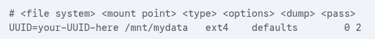

# Permanent Mounting

<mark>/etc/fstab</mark> contains static file system information
 

1. Identify the devide UUID (Universally Unique Identifier)
   `sudo blkid`
2. Create mount point
   `mkdir /mnt/mydata`
3. Add device to `/etc/fstab`
    
    **options**: defaults is a shorthand thta includes rw, exec, auto etc
    **dump**: used by dump backup utility (0 means disabled)
    **pass**: Determines the order of filesystems to check at boot time
    &nbsp;&nbsp;&nbsp;&nbsp;0 - no check
    &nbsp;&nbsp;&nbsp;&nbsp;1 - root filesystem
    &nbsp;&nbsp;&nbsp;&nbsp;2 - other filesystem
4. `sudo reboot`

*backup /etc/fstab before editing in case of error*
*after editing /etc/fstab check for errors sudo mount -a*