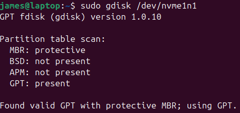
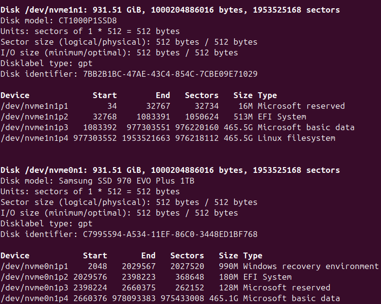

# Partitioning a disk

#### Partition table format

> ### fdisk
> fixed disk
> <mark>for MBR patition table format</mark> (Master Boot Record)
> `fdisk [disk]` **disk** that you want to partition
> e.g. `fdisk /dev/hda`
>  
>
> | | |
> |-|-|
> | `n` | create a partition
> | `d` | delete a partition
> | `l` | list partitions
>
> example *sudo fdisk -l*
> 

> #### gdisk
> <mark>for GPT table format</mark>
> **G**UID **P**artition **T**able (Globally Unique Identifier)
>  
>
> | | |
> |-|-|
> | `n` | create a partition
> | `d` | delete a partition
> | `l` | list partitions

> #### parted
> not in exam
> <mark>for all table formats</mark>
> <li>CLI or GUI</li>
> <li><mark>resize partitions easily (provided their not being used)</mark></li>