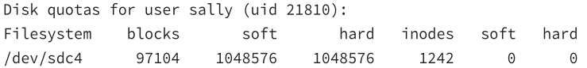

# Disk Quotas
* one user of a multi-user system can use all the disk space
* to manage this, Linux supports *disk quotas*
* you can enforce how much disk space individuals/groups can use
&nbsp;

### Enabling Quota Support
> #### quota
> display disk usage and limits
> installs other utility packages

### Configuration
modify */etc/fstab* for any partitions you want quota support
options
| | |
|-|-|
| `usrquota` | use user quota |
| `grpquota` | use group quota |

example line in /etc/fstab:
`/dev/nvme0n1p4 / ext4 usrquota,grpquota 1 1`
<li>activates user and group quota for <i>/dev/mvme0n1p4</i> partition  </li>
<li>partition is mounted at <i>/</i></li>
<li>to activate root can use <b>quotaon</b> command</li>
<li>to turn off <b>quotaoff</b></li>

> #### quotacheck
> creates and checks quota files:
> 1. *aquota.user*
> 2. *aquota.group*
>
> installed by `quota` package
> | | |
> |-|-|
> | `c` | create files|
> | `u` | check user quota |
> | `g` | check group quota |
>
> example
> `quotacheck -u /home`
> creates the quota file in the */home* directory

### Setting User Quotas
> #### edquota
> * edit user quotas
> * uses a text editor which a temporary configuration file **/etc/quotatab**
> * when you exit the utility, it writes the temporary file to the kernel
> &nbsp;
>
> example
> `edquota sally` shows:
> 
> both **blocks** and **inodes** have **soft** and **hard** limits
> | | |
> |-|-|
> | blocks | number of blocks being used  block size is configured by the filesystem|
> | inodes | number of files being used |
> | soft | issue warnings when exceeded  have a **grace time limit** - if soft quota is exceeded for greater than grace limit you can't create any new files |
> | hard | max limit |
> |`-t` | sets the grace period for a filesystem
> | `-g` | edit group quotas |
> | `-u` | edit user quotas |
