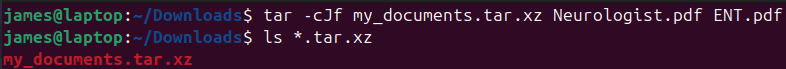

# Archiving files

### Archiving
<li>combining multiple files/directories into a single file, known as an <mark>archive file</mark></li>
<li>zip is also supported on Linux</li>
&nbsp;

#### Archiving Tools
`tar` - standard
`cpio` - not used much
`dd` - archive a file, device, filesystem (not used much)

> #### tar
> tape archive
> `tar [options] destination/tar-filename files-to-archive`
> &nbsp;
> <mark>tarball</mark> is a archive file created by tar, it's then usually compressed
> &nbsp;
> use one command with any option/s
> **commands**
> | | |
> |-|-|
> | `-c` `--create` | create archive |
> | `-t` `--list`| list archive contents |
> | `-x` `--extract` `--get` | extract files from archive |
>
> **options**
> | | |
> |-|-|
> | `-f` `--file file` | specify the name of the archive you're creating - *must be followed immediately by the archive name* |
> | `J` `--xz` | compress archive with xz |
>
> **compression tools**
> | | | |
> |-|-|-|
> | <b>gzip</b> | low compression (fast) | .gz |
> | <b>bzip2</b> | medium compression | .bz2 |
> | <mark><b>xz</b></mark> | high compression (slow) - <mark>best</mark> | .xz |
>
> example
> compress files
> 
> **my_documents.tar.xz**
> **.tar** - file is a tarball
> **.xz** - file compressed using xz
> &nbsp;
> compress a directory
> `tar cJf documents.tar.gz ~/Downloads/`

> #### dd
> data duplicator
> copies files at low level
> `dd if=<input-file> of=<output-file> [options]`
> **if** - can be a file, device, filesystem
> **of** - can be file, device or /dev/null (discards output)
> to restore swap the if and of options