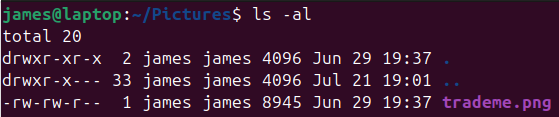

> #### ls
> list
> `ls [options] [files]`
>
> | | |
> |-|-|
> | `a` | show all files |
> | `l` | long listing - includes permissions, ownership, file size |
>
> 

> #### cp
> copy
> `cp [options] source destination`
> **source** can be one or more files
> | | |
> |-|-|
> | `R` | recursive - copy directory and its contents |
> 
> example
> `cp -R TempDir NewDir`

> #### mv
> move
> `mv [options] source destination`
> <li> move files and directories</li>
> <li>can optionally rename them</li>
> &nbsp;
> 
> **Renaming a file/directory** 
> example
> `mv document.txt sale.txt`

> #### rm
> remove
> `rm [options] files`
> | | |
> |-|-|
> | `r` `R` | recursive |
> 
> can't recover a removed file

> #### touch
> `touch [options] files`
> <li>update access and modification time of a file</li>
> <li>by default sets modification and access time to current time</li>
> &nbsp;
> Linux maintains 3 timestamps for every file:
> <ol>
> <li>last file-modification time</li>
> <li>last inode change (inode stores file metadata)</li>
> <li>last access time</li>
> </lo>
> 
> | | |
> |-|-|
> | `-t timestamp` | set time as specified |
> | `-a` `--time=atime` | change only access time |
> | `-m` `--time=mtime` | change only modification time |
>
> set timestamp syntax
> `MMDDhhmm[[CC]YY][.ss]`
> **hh** - hour (24 hour clock)
> **[[CC]YY]** - year e.g. 2012 or 12
> **ss** - second
