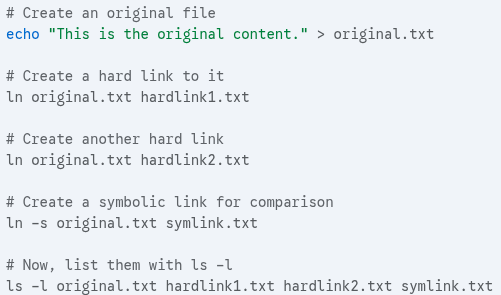
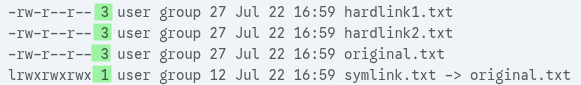
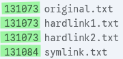

# Links

Like shortcuts in Windows
&nbsp;

### Hard links
* two entries that point to the same file
* links must be on the same filesystem as the file
* to delete the file, you must delete both
&nbsp;

### Symbolic links (soft links)
* a file that points to the linked-to file
* can point across filesystems

### Creating links
> #### ln
> link
> `ln [options] source link`
> **source** - original file
> **link** name of link you want to create
> by default creates hard links
> | | |
> |-|-|
> | `-s` `--symbolic` | create symbolic link |

> #### Existing links
> example
> &nbsp;
> 
> `ls -l` shows link count
> 
> 
> <li>3 hard links pointing to inode</li>
> <li>symlink.txt has link count 1</li>
> <li>symbolic links have their own inode</li>
> &nbsp;
> 
> `ls -i` shows inode number of each file
> 

