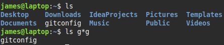

# Naming Files
File names are case sensitive
Restrict symbols to **dot(.)** **dash(-)** and **underscore (_)**
 

#### Filenames with spaces
escape the space `some\ file`
quotes `"some file"`
 

#### Dot Files
* Filenames can begin with a dot
* These files are hidden from view by most utilities
* They are mostly used for storing config files in home directory
 

**single dot (.)** filename - current directory 
**double dot (..)** filename - parent directory

# Wildcards
A symbol that stands for other characters

> Question mark **?**
> single character
> `b??k` → book etc

> Asterisk **\***
> any characters, including no character
> `b*k` → bk, book

> Brackets **[]**
> any character is the set
> `b[ae]ok` → baok
> `b[ae]o[kds]` → baok

> Range of values **[-]**
> `b[a-z]ck` → back

>**Example**
>wildcards can be used in commands
> 
> **Combining options**
> You can combine options e.g. `ls -lF`
> &nbsp;
> #### ls
> list
> `ls [options] [files]`
> | | |
> |-|-|
> | `a` | show all files |
> | `l` | long listing - includes permissions, ownership, file size |
> 
> 

> #### cp
> copy
> `cp [options] source destination`
> **source** can be one or more files
> | | |
> |-|-|
> | `R` | recursive - copy directory and its contents |
> 
> example
> `cp -R TempDir NewDir`

> #### mv
> move
> `mv [options] source destination`
> <li> move files and directories</li>
> <li>can optionally rename them</li>
> &nbsp;
> 
> **Renaming a file/directory** 
> example
> `mv document.txt sale.txt`

> #### rm
> remove
> `rm [options] files`
> | | |
> |-|-|
> | `r` `R` | recursive |
> 
> can't recover a removed file

> #### touch
> `touch [options] files`
> <li>update access and modification time of a file</li>
> <li>by default sets modification and access time to current time</li>
> &nbsp;
> Linux maintains 3 timestamps for every file:
> <ol>
> <li>last file-modification time</li>
> <li>last inode change (inode stores file metadata)</li>
> <li>last access time</li>
> </lo>
> 
> | | |
> |-|-|
> | `-t timestamp` | set time as specified |
> | `-a` `--time=atime` | change only access time |
> | `-m` `--time=mtime` | change only modification time |
>
> *set timestamp syntax* `MMDDhhmm[[CC]YY][.ss]`
> **hh** - hour (24 hour clock)
> **[[CC]YY]** - year e.g. 2012 or 12
> **ss** - second

# Archiving files
### Archiving
<li>combining multiple files/directories into a single file, known as an <mark>archive file</mark></li>
<li>zip is also supported on Linux</li>
&nbsp;

#### Archiving Tools
`tar` - standard
`cpio` - not used much
`dd` - archive a file, device, filesystem (not used much)

> #### tar
> tape archive
> `tar [options] destination/tar-filename files-to-archive`
> &nbsp;
> <mark>tarball</mark> is a archive file created by tar, it's then usually compressed
> &nbsp;
> use one command with any option/s
> **commands**
> | | |
> |-|-|
> | `-c` `--create` | create archive |
> | `-t` `--list`| list archive contents |
> | `-x` `--extract` `--get` | extract files from archive |
>
> **options**
> | | |
> |-|-|
> | `-f` `--file file` | specify the name of the archive you're creating - *must be followed immediately by the archive name* |
> | `J` `--xz` | compress archive with xz |
>
> **compression tools**
> | | | |
> |-|-|-|
> | <b>gzip</b> | low compression (fast) | .gz |
> | <b>bzip2</b> | medium compression | .bz2 |
> | <mark><b>xz</b></mark> | high compression (slow) - <mark>best</mark> | .xz |
>
> **example**
> compress files
> 
> **my_documents.tar.xz**
> **.tar** - file is a tarball
> **.xz** - file compressed using xz
> &nbsp;
> compress a directory
> `tar cJf documents.tar.gz ~/Downloads/`

> #### dd
> data duplicator
> copies files at low level
> `dd if=<input-file> of=<output-file> [options]`
> **if** - can be a file, device, filesystem
> **of** - can be file, device or /dev/null (discards output)
> to restore swap the if and of options

# Directory Commands
> #### mkdir
> make directory
> `mkdir [options] directory-names`

*When deleting a directory tree filled with files,use **rm -r** instead of rmdir. This is because rmdir can only delete empty directories*

> #### rmdir
> remove directory
> `rmdir [options] directory-names`

