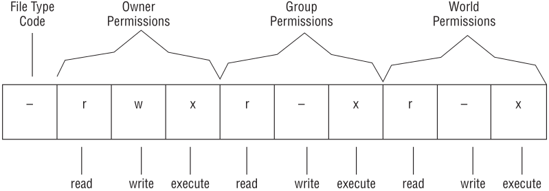

# Permissions

permissions don't apply to root
however root still needs execute bit to run a program
but can change permissions on any file
&nbsp;

#### Permission strings
10 characters long

**File type**
`-` regular file
`d` directory
`l` symbolic link 
&nbsp;

**execute** - file may be run as a program
&nbsp;

#### Permission bits
<ol>
<li>individual permissions e.g. execute access for file owner, are often referred to as permission bits</li>
<li>linux encodes this information in binary</li>
<li>permission information can be expressed as a 9-bit number</li>
<li>the number is expressed in octal (base 8)</li>
<li>the base-8 representation of a permission string is three characters long; one for owner, group and world</li>
</ol>

&nbsp;
<b>octal permissions:</b>
1 execute
2 write
4 read
&nbsp;

example
`-rwxrw-r--`
`111110100`
1. group bits
`111 110 100`
2. convert to octal
`111` 2^0 2^1 + 2^2 = 7
`110` 2^1 + 2^2 = 6
`100` 2^2 = 4
3. combine octal digits
764

> #### Common permissions
> | string | octal |
> |-|-|
> | rwxrwxrwx | 777 |
> | rwx------ | 700 |
> | rwxr-xr-x | 755 |

