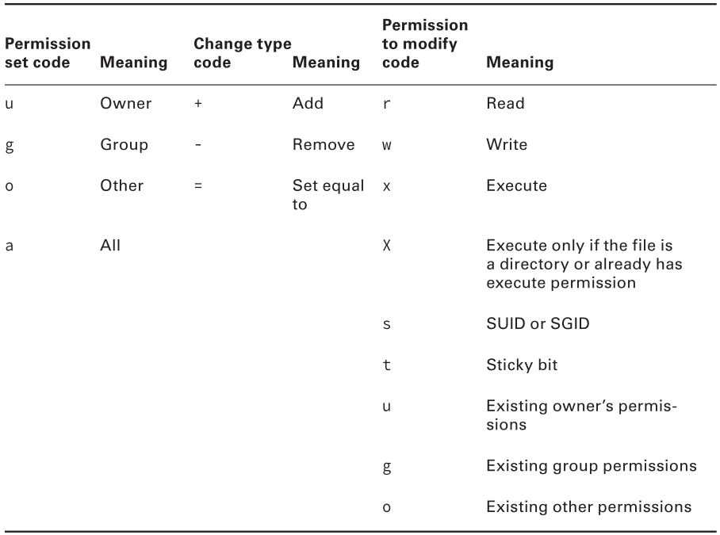
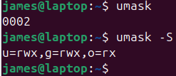

# Permissions
permissions don't apply to root
however root still needs execute bit to run a program
but can change permissions on any file
&nbsp;

#### Permission strings
10 characters long

**File type**
`-` regular file
`d` directory
`l` symbolic link 
&nbsp;

**execute** - file may be run as a program
&nbsp;

#### Permission bits
<ol>
<li>individual permissions e.g. execute access for file owner, are often referred to as permission bits</li>
<li>linux encodes this information in binary</li>
<li>permission information can be expressed as a 9-bit number</li>
<li>the number is expressed in octal (base 8)</li>
<li>the base-8 representation of a permission string is three characters long; one for owner, group and world</li>
</ol>

&nbsp;
<b>octal permissions:</b>
1 execute
2 write
4 read
&nbsp;

example
`-rwxrw-r--`
`111110100`
1. group bits
`111 110 100`
2. convert to octal
`111` 2^0 2^1 + 2^2 = 7
`110` 2^1 + 2^2 = 6
`100` 2^2 = 4
3. combine octal digits
764

> #### Common permissions
> | string | octal |
> |-|-|
> | rwxrwxrwx | 777 |
> | rwx------ | 700 |
> | rwxr-xr-x | 755 |

# Special Permissions
#### Set User ID (SUID)
run the program with the permissions of whoever owns the file
e.g. if a file is owned by root, the program runs with root privileges
&nbsp;

SUID is shown by a <mark>s</mark> in the owners execute bit
if set on a file without user execute permissions, shown by <mark>S</mark>
e.g. `rwSr-xr-x`
&nbsp;

#### Set Group ID (SGID)
sets the group permissions
same rules as SUID
e.g. `rwxr-s-x`
&nbsp;

#### Sticky Bit
set on a directory
shown as <mark>t</mark>
directories files can only be deleted by:
<li>their owners</li>
<li>directories owner</li>
<li>root</li>

e.g. `rwxr-xr-t`

# Access Control List (ACL)
#### Discretionary Access Control (DAC)
uses permissions string
&nbsp;

#### Access Control List (ACL)
set per file
list of users/groups and the permissions they are given
set - `setfacl`
view - `getfacl`

# Changing Mode
modify file permissions
> #### chmod
> change mode
> `chmod [options] [mode] filename`
> | | |
> |-|-|
> | `-R` `--recursive` | changes all files in directory tree |
>
> example
> `chmod 644 file.dat`

#### Setting Special Permissions
add a number before the three octal digits
setting the first digit as 0 removes all special permissions
&nbsp;

**bit permissions:**
1 sticky bit permission
2 SGID permission
4 SUID permission
&nbsp;

example
`chmod 6750 program.sh`
SGID = 2
SUID = 4
2+4=6
&nbsp;

#### Symbolic Mode
codes for permissions

example
`chmod a+x bigprogram`
`chmod g=u bigprogram`# Default Permissions
When creating a file, it has default permissions
&nbsp;&nbsp;&nbsp;&nbsp;**owner** is whoever created the file
&nbsp;&nbsp;&nbsp;&nbsp;**group** is the users primary group
&nbsp;

default permissions are configurable

> #### umask
> user mask
> takes an octal value that represents bits to be removed from either:
> &nbsp;&nbsp;&nbsp;&nbsp;777 directories (default)
> &nbsp;&nbsp;&nbsp;&nbsp;666 files (default)
> &nbsp;
> 
> **examples**
> | unmask | created files | created directories |
> |-|-|-|
> | 000 | 666 (rw-rw-rw-) | 777 (rwxrwxrwx) |
> | 022 | 644 (rw-r--r--) | 755 (rwxr-xr-x) |
> | 077 | 600 (rw-------) | 700 (rwx------) |
> 
> **default unmask**
> 
> the first digit is the octal code for SUID, SGID and the sticky bit
> &nbsp;
>
> **To change unmask**
> 1. `unmask 0022`
> changes to 0022
> 2. `umask u=rwx,g-rx,o=rx`
> equivalent to method 1

### Default Group
users can change their default group

> #### newgrp
> new group
> the user using this command must be a member of that group
> example `newgrp skygroup`# File Attributes
you can change attributes for most file systems using `chattr`

> #### chattr
> `chatter +/-[option] file`
> options
> | | |
> |-|-|
> | `A` | no access time updates  don't updated access timestamp when accessing a file |
> | `i` | immutable  don't updated access timestamp when accessing a file |
>
> example
> `chattr +i important.txt`