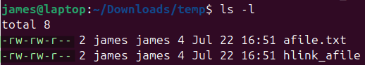

# Checking

File permission tiers:
<ol>
<li>owner</li>
<li>group</li>
<li>other users</li>
</ol>

> `ls -l`
> 
> **owner** james -rw
> **group** james

> #### Permission strings
> -rw-rw-rw--
> | index | |
> |-|-|
> | 1 | file type:   `-` regular file  `d` directory  `l` symbolic link |
> | 2,3,4 | *owner permissions*  **r**ead **w**rite **e**xecute |
> | 5,6,7 | *group permissions* |
> | 8,9,10 | *other permissions* |