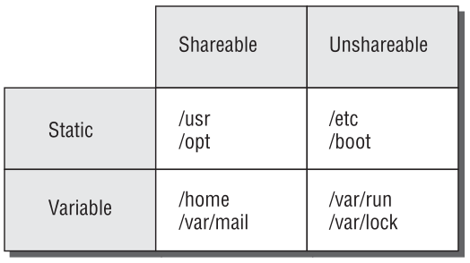

# Filesystem Hierarchy Standard (FHS)
Standardizes linux directories and programs
www.pathname.com/fhs/
&nbsp;

### Terms
**shareable files** 
can be shared between computers
e.g. user data files, program binary files
&nbsp;

**un-shareable files** 
contain system-specific information
e.g. config files
&nbsp;

**static files** 
only changed by the system administrator
e.g. program executables
&nbsp;

**variable files**
home directory files
email files
&nbsp;

FHS tries to fit all the important directories into a 2x2 matrix

# Important Directories and Contents
www.pathname.com/fhs/
| | |
|-|-|
| `/` | root directory all directories branch off it |
| `/boot` | boot files |
| `/home` | user data |
| `/opt` | add-on application packages  for large third-party software that doesn't follow FHS conventions |
| `/tmp` | temporary files |
| `/usr` | contains programs  divided into subdirectories | 
| | `/usr/local` software installed locally |
| `/var` | variable data  logs, mail files etc |
| `/bin` | user command binaries  *cat, cp, kill, ls, mkdir, ps, rm* |
| `/dev` | device files  hardware devices are treated as files | 
| `/etc` | configuration files |
| `/lib` | libraries  files shared across many programs  |
| | `/lib/modules` contains kernel modules (drivers) |
| `/sbin` | system admin binaries  *fdisk, mkswap* |

# Locating Files
> #### find
> `find [path] [expression]`
> **expression**
> | | ||
> |-|-|-|
> | by name| `-n pattern` | `find . -name "*.txt"` |
> | by file size | `-size [+\|-]n` | by default n is 512-byte blocks  can modify by trailing the value with a letter code e.g. M for megabytes  `find . -size +10M`  | 
> | by User Id | `-uid UID` | 
> | by username | `-user name` |
> | restrict search depth | `-maxdepth levels` | limit recursive directories to search |

> #### locate
> search from a database updated daily
> search may not return recently created files
> update it manually using `updatedb` which is configured at */etc/updatedb.conf*
> `locate search-string`