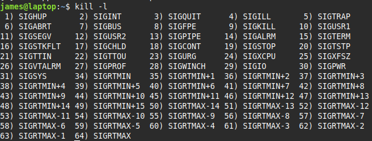

# Killing processes

> `kill -s signal pid` 
> sends a signal to a process
> kills processes owned by the user who runs kill, root can kill any users processes

> #### signal
> <li>Linux has lots of signals (method to communicate with a process)</li>
> <li>each with a specific name</li>
> <li>You can specify a signature with its number (eg 9) or name (SIGKILL)</li>
>  
> 
> get all signals `kill -l` 
> 
>  
> * `9)SIGKILL` kill without performing shutdown tasks 
> * `15)SIGTERM` *graceful shutdown* - kill but allows it to close open files, save data etc 
> * `15)SIGTERM` is default

> ### nohup
> When you log out of a session, the programs you started are terminated
> To run a program that will keep running when you log out
> e.g. run servers
> `nohup [program] [options]`