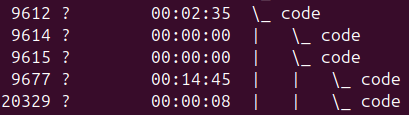
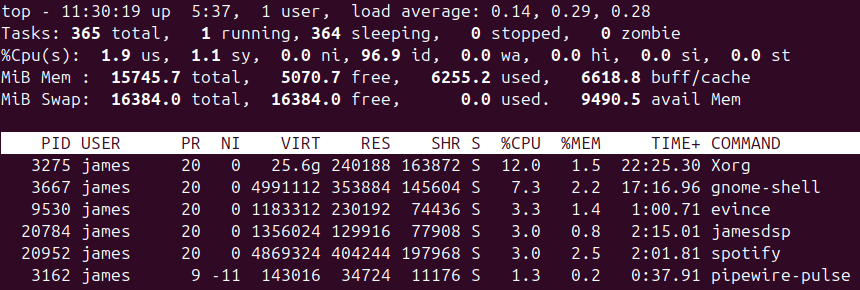

# The Kernel

When you type a command name, that program is run and a *process* is created for it
<li>Processes are user run programs</li>
<li>The kernel is always run, it manages hardware</li>

You can get info about the kernel using `uname`
> #### uname
>  
> | option |                                         |
> |------|------------------------------------------------|
> | `-a` | all info                                       |
> | `-n` | system node name i.e. network hostname         |
> | `-s` | kernel name                                    |
> | `-v` | kernel version                                 |
> | `-r` | kernel version number                          |
> | `-m` | machine info e.g. CPU code                     |
>
>

# Examining Processes
> #### ps [options]
> process status
>
>
> *three different types of options:*
> |                 |                                  |
> | --------------- | -------------------------------- |
> | `-` single dash | can be grouped together e.g. -Ax |
> | `()` no dash    | can be grouped together          |
> | `--` two dash   | **can't** be grouped together    |
>
> options
> |                 |                                  |
> | --------------- | -------------------------------- |
> | `-A` `-e`       | all processes on the system      |
> | `x`             | all processes owned by the user  |
> | `--h`           | help                             |
> | `v `            | extra information        |

 **Output Column Names** 

 * **PID** &nbsp; Process ID 
 * **PPID** &nbsp; Parent Process ID 
 * **TTY** &nbsp; TeleTYpe code to identify a terminal 
 * **TIME**, **%CPU** &nbsp; CPU time consumed/percentage when executed 
 * **CPU Priority** &nbsp; Default value 0 - positive values *reduce* priority, negative *increase* 
 * **Command** &nbsp; launch process
 * **RSS**, **%MEM** memory - Resident Set Size (program + data)
 

example
<mark>view a particular process</mark>
`ps -A | grep bash`
 

example
view parent/child processes
`ps -A --forest`

 

### Foreground & background processes
Foreground process - takes over control of the terminal, preventing you from doing other work

* `Ctrl+Z` pauses the program and gives you back the terminal
* `fg` restores the foreground program
* `bg` restore the foreground program, but run it in the background
 

## Resource usage
> ### top
> examining process <mark>CPU usage</mark>
> updates every few seconds
> | option    |                               |
> |-----------|-------------------------------| 
> |`-d delay` | specify delay between updates |
> | `-p pid`  | to monitor a specific process |
> 
> 
> 
> **load average (top line):** shows *current load average : two previous measures*
> &nbsp;&nbsp;&nbsp;&nbsp;0 = no programs demanding cpu
> &nbsp;&nbsp;&nbsp;&nbsp;1 = one program running CPU-intensive tasks
> &nbsp;&nbsp;&nbsp;&nbsp;higher averages = multiple programs competing for CPU time
> &nbsp;
> when it's running you can use these commands:
> `k` kill a process - will ask for PID
> `q` quit

> ### free
> for examining Memory usage# Process priorities

`nice` launch a program with a specified priority
`renice` change a running process priority

> `nice [argument] [command]` 
> You can assign a priority in 3 ways:
> * `nice -12 number-crunch data.txt` *(assigns 12 not -12)*
> * `nice -n 12 number-crunch data.txt`
> * `nice --adjustment=12 number-crunch data.txt`
> run *number-crunch* at priority 12 and pass in *data.txt*
>  
> * 0 default
> * -20 (highest)
> * 19 (lowest)

> `renice priority [-p [pids]] [-g [pgrps]] [-u [users]]`
> specify:
> * **priority**
> * **pids** 1+ PIDs
> * or **pgrps** 1+ group IDs
> * or 1+ **users** usernames

example
`renice 7 16580 -u pdavison tbaker`
**7** set *priority*
**16580** to process with *PID* 
**pdavison** **tbaker** amd all processes owned by *users*

# Killing processes
> `kill -s signal pid` 
> sends a signal to a process
> kills processes owned by the user who runs kill, root can kill any users processes

> #### signal
> <li>Linux has lots of signals (method to communicate with a process)</li>
> <li>each with a specific name</li>
> <li>You can specify a signature with its number (eg 9) or name (SIGKILL)</li>
>  
> 
> get all signals `kill -l` 
> 
> 
> 
> * `9)SIGKILL` kill without performing shutdown tasks 
> * `15)SIGTERM` *graceful shutdown* - kill but allows it to close open files, save data etc 
> * `15)SIGTERM` is default

> ### nohup
> When you log out of a session, the programs you started are terminated
> To run a program that will keep running when you log out
> e.g. run servers
> `nohup [program] [options]`