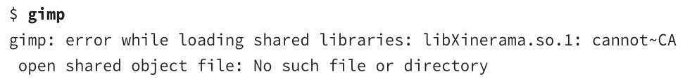

# Libraries
<li>many packages can use the same shared library</li>
<li>you can have multiple versions of the same library installed</li>
<li>major package upgrades are installed side by side with their older counterparts</li>
<li>the files have a <mark>.so</mark> or .so.version extension, similar to Windows .dll files</li>
 

**static libraries** - contained in the package
**dynamic libraries** - shared

### System Library path
contained in `/etc/ld.so.conf`
example - *include /etc/ld.so.conf.d/*.conf*
can have multiple paths
Linux also refers to trusted libraries in `/lib` and `/usr/lib`
 

### Environment variable
`LD_LIBRARY_PATH`
specifies additional directories to search for libraries
example `export LD_LIBRARY_PATH=/usr/local/testlib:/opt/new/lib`
specifies 2 paths seperated by <mark>:</mark>

### Errors
**example**

it could find the library *libXinerama.so.1*
 

**troubleshooting**
<li>check if library installed</li>
<li>if library is installed, you may need to add it to the Library Path</li>
<li>Sometimes the libraries <mark>path is hardcoded</mark> in the programs binary file, you can create a symbolic <mark>link</mark> from where the program expects it and the location of the library on your system</li>

**example**
A program may link to `biglib.so.5` but you have `biglog.so.5.2` installed, so creating a <mark>link</mark> would solve the problem

