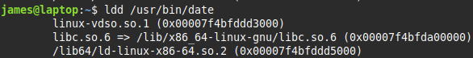

# Library Management

*<mark>libraries can depend on other libraries
so a library may be there, but its dependencies are not installed</mark>*

> ### ldd
> displays a programs shared libraries
> example
> 

> ### ldconfig
> updates caches and links used by the system for locating libraries
> it reads */etc/ld.so.conf* and implements any changes in that file

